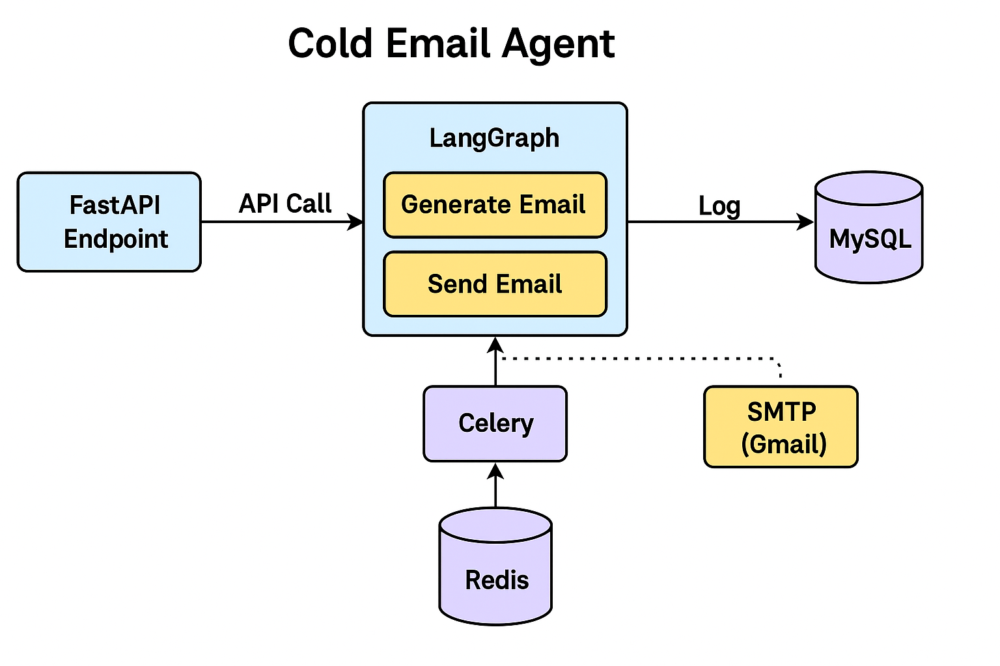

# 🤖 Cold Email Agent (AI-Powered)

This project is a complete AI-powered Cold Email Automation Agent that:
- Takes a **Job Description**
- Generates a **personalized cold email** using **Google Gemini**
- Sends the email via **Gmail (SMTP)** to the specified HR email
- Logs all activity into a **MySQL database**
- Uses **LangGraph** for modular flow control and **Celery + Redis** for background task processing

---

## 🧠 Tech Stack Explained

| Technology     | Purpose                                                                 |
|----------------|-------------------------------------------------------------------------|
| **Python**      | Main programming language                                                |
| **FastAPI**     | Web framework for building the API (e.g., `/send_email`)                |
| **LangGraph**   | Flow control framework (e.g., Generate Email → Send Email)              |
| **Gemini API**  | Google's LLM to generate personalized cold emails                       |
| **Celery**      | Asynchronous task queue (handles email sending in background)           |
| **Redis**       | Message broker used by Celery                                            |
| **MySQL**       | Stores a log of each email that was sent                                |
| **SMTP (Gmail)**| Sends the actual email using Gmail SMTP server                          |
| **.env**        | Manages API keys and secrets securely                                   |

---

## 🚀 Features

- Accepts sender email credentials and resume
- Uses Google Gemini to write a custom cold email
- Sends the email using Gmail App Password
- Logs the job description, sender, HR email, and body into MySQL
- Sends emails asynchronously using Celery

---

## 📁 Project Structure

```
cold_email_agent/
├── main.py                  # FastAPI entry point
├── langgraph_email_agent.py # LangGraph logic + Gemini call
├── email_sender.py          # Celery task for sending email
├── email_utils.py           # Utilities for formatting and parsing emails
├── celery_worker.py         # Celery app setup
├── db.py                    # MySQL logging functions
├── redis.conf               # (Optional) Custom Redis config
├── templates/
│   └── email_template.txt   # Optional text template
├── .env                     # Contains API keys, DB credentials
└── requirements.txt         # Python dependencies
```

---

## 🔐 Setup Guide

### 1. ✅ Clone and Create a Virtual Environment

```bash
git clone https://github.com/your-username/cold_email_agent.git
cd cold_email_agent

python -m venv .venv
source .venv/bin/activate       # On Linux/macOS
# OR
.venv\Scripts\activate          # On Windows

pip install -r requirements.txt
```

---

### 2. ✅ Setup `.env` File

Create a `.env` file in the root directory:

```env
GEMINI_API_KEY=your_gemini_api_key_here
MYSQL_USER=root
MYSQL_PASSWORD=your_mysql_password
MYSQL_DB=cold_email_logs

sender_email=youremail@gmail.com
sender_app_password=your_gmail_app_password_here
```

> ⚠️ You must [enable 2FA](https://myaccount.google.com/security) in Gmail and create an [App Password](https://myaccount.google.com/apppasswords)

---

### 3. ✅ Start MySQL and Redis

- 🐬 Start **MySQL** locally or via services like XAMPP, Docker, etc.
- 🔴 Start **Redis server**:
-👉 **Redis Download Link for Windows**:
https://github.com/tporadowski/redis/releases
Download the *.msi* or *.zip* file and install it. Then run:

```bash
# Mac/Linux
redis-server

# Windows (use Redis from Memurai or Redis Windows port)
redis-server.exe
```

---

### 4. ✅ Start Celery Worker

```bash
celery -A celery_worker.celery worker --loglevel=info
```

This will wait for background tasks (email jobs).

---

### 5. ✅ Start FastAPI Server

```bash
uvicorn main:app --reload --host 127.0.0.1 --port 8002
```

Go to: [http://127.0.0.1:8002/docs](http://127.0.0.1:8002/docs)

---

## 📬 Usage Example (via Swagger UI)

- **job_description**: `"AI Intern with interest in LangChain"`
- **hr_email**: `"hr@company.com"`
- **sender_email**: `"youremail@gmail.com"`
- **sender_app_password**: `"your-app-password"`
- **resume_file**: Upload a `.pdf` file (optional)

✅ Click "Execute" → Email will be sent → Logged in MySQL

---

## 🧾 MySQL Table Schema

```sql
CREATE TABLE IF NOT EXISTS email_logs (
    id INT AUTO_INCREMENT PRIMARY KEY,
    sender_email VARCHAR(255),
    hr_email VARCHAR(255),
    job_description TEXT,
    email_body TEXT,
    sent_at TIMESTAMP DEFAULT CURRENT_TIMESTAMP
);
```

---

## 🧠 Concepts in Brief

### ✅ LangGraph
Think of LangGraph as a flowchart for your logic.  
In this project:
1. **Generate Email** using Gemini
2. **Send Email** via Celery
3. **Log** to database

### ✅ Celery + Redis
- Celery runs tasks asynchronously (non-blocking)
- Redis stores and queues those tasks for workers

---

## 🛠️ Troubleshooting

| Problem | Solution |
|--------|----------|
| `Invalid API Key` | Regenerate Gemini key from [Makersuite](https://makersuite.google.com/app/apikey) |
| `SMTP 535 error` | Use Gmail App Password (2FA must be ON) |
| `Celery not receiving tasks` | Make sure Redis is running |
| `.env not loading` | Check file name isn't `.env.txt` |

---
## 🧭 Architecture Diagram

Here's how the Cold Email Agent works internally:



---
## ✨ Future Improvements

- Add email tracking (open/read notifications)
- Customize template using Jinja2
- Add resume parsing and personalized cover letter
- Web UI frontend (React or HTML)

---

## 🙌 Credits

Made with ❤️ by Charan
Tech Stack: FastAPI, LangGraph, Gemini, Celery, Redis, MySQL
